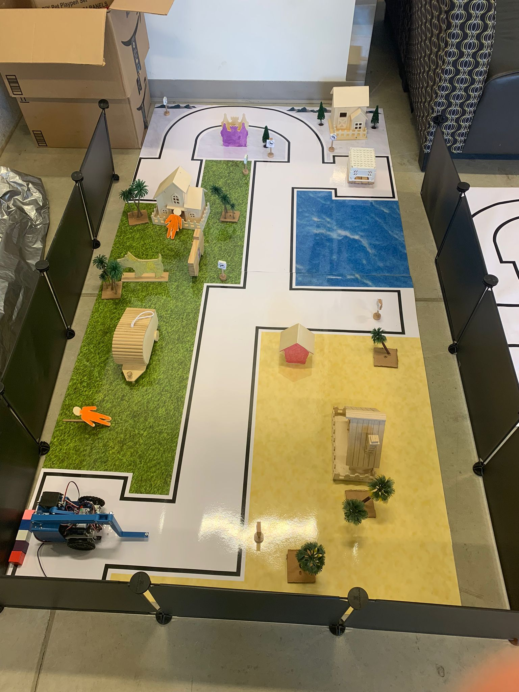

# Robot Car Track

This repository contains a vector graphic representation of a robot car track created using Inkscape. The track is designed for use in robotics projects, providing a visually appealing and customizable environment for testing and demonstrations.

## Table of Contents

- [Features](#features)
- [Usage](#usage)
- [License](#license)

## Features

- **Scalable Design:** The track is created as a vector graphic, allowing for easy scaling without loss of quality.
- **Customizable Layout:** Modify and adapt the track layout to suit your specific requirements.
- **Printable:** The vector format allows for high-quality printing for physical use.
- **Ideal for Simulations:** Use the track for simulating robot car movements and testing algorithms.

## Usage

1. **Download:** Clone or download the repository to access the Inkscape SVG file.
2. **Open in Inkscape:** Open the SVG file in Inkscape to view and edit the track.
3. **Customize:** Modify the track layout, add obstacles, or tailor it to your project needs.
4. **Export or Print:** Export the track to various formats or print it for physical use.

## License

This project is licensed under the terms of the [GNU General Public License (GPL) version 3.0](LICENSE).

You can find a copy of the license in the [LICENSE](LICENSE) file included with this distribution.
